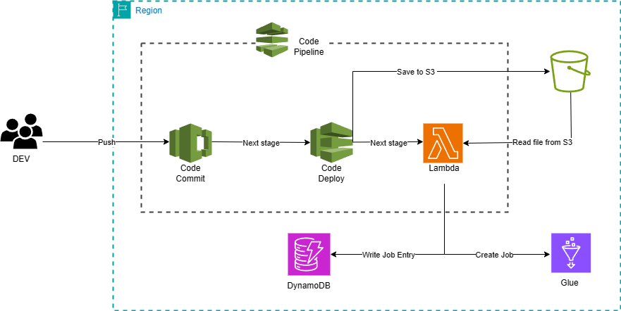

# CI/CD VỚI AWS

### Tổng quan

 Trong bài lab này, chúng ta sẽ cùng nhau đi xây dựng 1 luồng ***CI/CD*** bằng các công cụ hỗ trợ ***CI/CD*** trên nền tảng AWS

### Nội dung

 1. [Giới thiệu](1-Introduce/)
 2. [Tổng quan kiến trúc](2-Overview/)
 3. [Tạo các Policy và Role cần thiết](3-PolicyAndRole/)
 4. [Tạo repository trên CodeCommit](4-CreateRepo/)
 5. [Tạo các Lambda](5-CreateLambda/)
 6. [Tạo bảng DynamoDB và S3 Bucket](6-CreateDynamoDB_S3/)
 7. [Tạo luồng CodePipeline](7-CreatePipeline/)
 8. [Kiểm tra kết quả chạy](8-Check/)
 9. [Dọn dẹp tài nguyên](9-Cleanup/)
